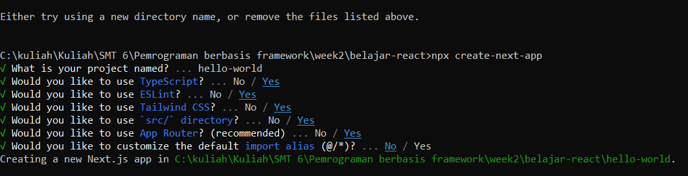
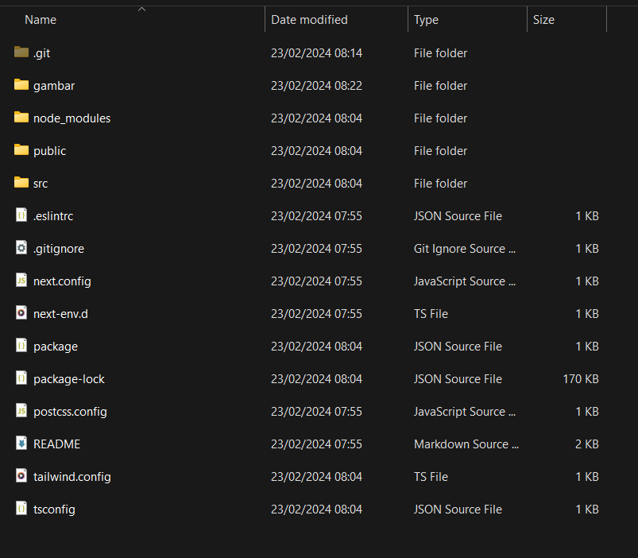
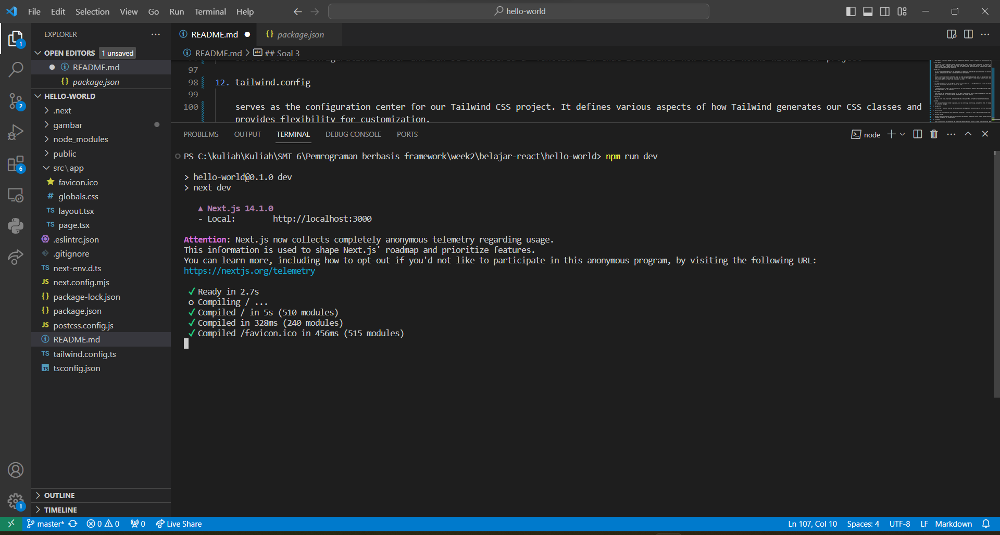
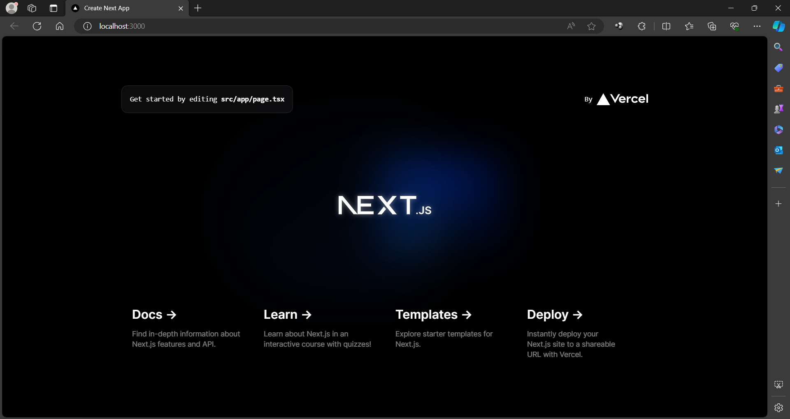
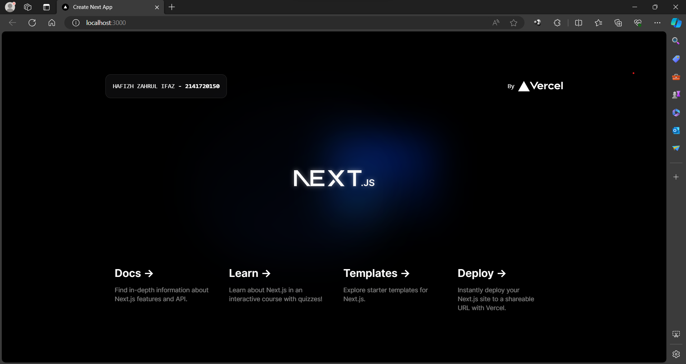

This is a [Next.js](https://nextjs.org/) project bootstrapped with [`create-next-app`](https://github.com/vercel/next.js/tree/canary/packages/create-next-app).

## Getting Started

First, run the development server:

```bash
npm run dev
# or
yarn dev
# or
pnpm dev
# or
bun dev
```

## Laporan Praktikum

|  | Pemrograman Berbasis Framework 2024 |
|--|--|
| NIM |  2141720150|
| Nama |  Hafizh Zahrul Ifaz |
| Kelas | TI - 3I |

## Soal 1

Pada gambar tersebut, silakan Anda browsing apa yang dimaksud dengan:

1. TypeScript

   TypeScript is a programming language superset of JavaScript that adds features such as static data types, classes, and modules. TypeScript supposed to help us write code that is more structured and easy to read, and prevents errors at runtime.

2. ESLint

    ESLint is a linter for JavaScript that helps developers find and fix errors in their code. ESLint can detect various types of errors, such as syntax errors, logical errors, and style errors.

3. Tailwind CSS
    
    Tailwind CSS is a utility-first CSS framework that helps developers build user interfaces quickly and easily. Tailwind CSS provides a wide variety of CSS classes that can be used to style HTML elements.

4. App Router

   App Router is a library for Next.js that helps developers manage the routing of their applications. App Router allows developers to define routes for their pages and components, as well as handle navigation between pages.

5. Import alias

    Import aliases is a feature in TypeScript that allows developers to import modules with shorter names. Importing aliases can help developers make their code easier to read and maintain.


## Soal 2

Pada struktur project tersebut, jelaskan kegunaan folder dan file masing-masing tersebut!

1. folder node_modules 

    node_modules is the folder used to store all the JavaScript modules required by a Node.js project. It is an important part of Node.js development. It helps us manage our project dependencies, provides access to ready-to-use functionality, and saves time and effort.

2. folder public
    
    In a Next.js project, the public folder serves a crucial role in housing static assets that are directly accessible by the user's browser. Just like a treasure chest overflowing with images, fonts, CSS files, favicon, and robot.txt - all readily accessible by the user's browser without needing the server to do any heavy lifting. This translates to lightning-fast loading times for these assets, keeping our website zippy and responsive.

3. folder src

    src is an important foundation in web development. It enables us to build web applications that are structured, organized, and easy to maintain, and produce code that is optimized for best performance.

4. .git

    serves as a version control system that keeps our code consistent and organized. with git we can track every change, every edit to our code file is logged, like a digital footprint. It's easier: Working with a team becomes more efficient. And it stores securely in a centralized repository, ready to be accessed at any time.

5. .eslintrc

   file plays a crucial role in configuring ESLint for our project. It's a configuration file written in JSON or JavaScript that defines the rules and settings used by ESLint to analyze our code.

6. .gitignore

    a configuration file used in Git version control. It serves a specific purpose: specifying files and folders you want to exclude from being committed to our Git repository.

7. next.config

    file serves as the configuration center for our Next.js application. It's a JavaScript/TypeScript file that allows you to customize various aspects of our project's build, development, and runtime behavior.

8. next-env.d

    helps us write clean, type-safe, and organized code, making our Next.js TypeScript project a masterpiece.

9. package

    offer various functions related to packages, such as installing, uninstalling, and updating them. For example, npm install is a function for installing packages.

10. package-lock

    It serves as a lockfile, ensuring reproducible builds and dependency consistency across different environments.

11. postcss.config

    serves as our configuration center and can be considered a "function" in that it defines how PostCSS works within our project

12. tailwind.config

    serves as the configuration center for our Tailwind CSS project. It defines various aspects of how Tailwind generates our CSS classes and provides flexibility for customization.

13.  tsconfig

    plays a crucial role in configuring the TypeScript compiler for your project. It acts as a central hub, defining various aspects of how TypeScript interprets, compiles, and checks our code.


## Soal 3
1. 

2. 

3.  


